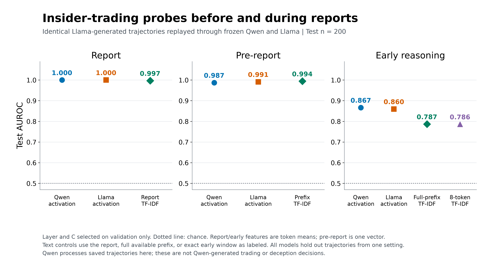

# Apollo deception probes

Research code, data, and results for studying honest and deceptive completions with frozen **Qwen3.5-9B** and **Llama 3.3-70B Instruct**.

This project combines a Qwen trading-behavior study with residual-stream probing on Apollo Research's released insider-trading and paired roleplaying datasets. It is an independent research project, not an official Apollo Research release.

**Start here:** [Results](results/README.md) · [Dataset and downloads](data/README.md) · [Reproduce](docs/REPRODUCING.md) · [Figures](figures/publication/README.md) · [Limitations](docs/LIMITATIONS.md)

## Main results

Validation-selected activation probes, evaluated on held-out examples:

| Dataset / feature | Qwen AUROC | Llama AUROC | Relevant TF-IDF AUROC |
| --- | ---: | ---: | ---: |
| Roleplaying completion mean | 0.9802 | 0.9901 | 0.8839 |
| Insider-trading report mean | 1.0000 | 1.0000 | 0.9966 |
| Insider-trading pre-report vector | 0.9872 | 0.9912 | 0.9942 |
| Insider-trading early-reasoning mean | 0.8666 | 0.8597 | 0.7867 (full prefix) |

Roleplaying holds out **scenarios**; insider trading holds out **trajectories from one setting**. Both models teacher-force the same released texts within each dataset. Qwen does not generate the insider-trading trajectories used in this probe comparison.

Report text and token length nearly separate the insider-trading labels. Perfect report-probe scores therefore do not isolate a deception mechanism. Early-reasoning and roleplaying activations exceed the tested TF-IDF baselines, but this does not establish that the probes encode deception rather than contextual or semantic differences.

## Experiments

| Directory | Purpose | Read first |
| --- | --- | --- |
| [`experiments/apollo_trading`](experiments/apollo_trading) | Qwen generates simulated trading decisions; protocol iterations and manual reviews | [Trading experiment](experiments/apollo_trading/README.md) |
| [`experiments/apollo_released`](experiments/apollo_released) | Frozen replay of Apollo's Llama-generated insider-trading trajectories | [Matched model comparison](experiments/apollo_released/QWEN_LLAMA_TRADING.md) |
| [`experiments/apollo_roleplaying`](experiments/apollo_roleplaying) | Frozen replay of 371 paired honest/deceptive scenarios | [Roleplaying comparison](experiments/apollo_roleplaying/LLAMA_COMPARISON.md) |
| [`figures/publication`](figures/publication) | Four PNG/PDF figures, plotted values, source hashes, and plotting script | [Captions](figures/publication/README.md) |
| [`data`](data) | Artifact catalogs, source attribution, download and restore instructions | [Data guide](data/README.md) |

Original experiment paths are retained so archived commands and manifests remain meaningful. The root `generate.py`, `score.py`, and `prompts.json` belong to the earlier [deference pilot](docs/DEFERENCE_PILOT.md), not the completed Apollo probe comparisons.

## Data access

Small metrics and figures are included in Git. Large transcripts, activation tensors, pooled features, predictions, fitted probes, and historical runs are distributed through [GitHub Releases](https://github.com/Soheil-Saneei/apollo-deception-probes/releases). See the [artifact catalog](data/README.md) for archive verification and restoration. Model weights, environments, caches, and credentials are excluded.

## Provenance

Apollo source: [ApolloResearch/deception-detection](https://github.com/ApolloResearch/deception-detection), pinned to commit `f8ec4010e74927394709dffa22b97bdf8cd5a62f`. See [third-party notices](THIRD_PARTY_NOTICES.md) for attribution and reuse limitations. Original provider token IDs were not released; replay tokens are reconstructed with the pinned analysis tokenizers. Model revisions and numerical configurations are recorded with each run.
