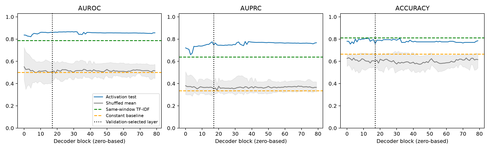

# Fixed early-reasoning window

## Full-prefix text control

The follow-up `compare_full_prefix.py` gives TF-IDF **every input token through
the same final window token**, including the system prompt, all prior messages,
the reasoning wrapper and the early window. It decodes the original token IDs
directly, adds no later text, and checks all 999 endpoints against saved character
offsets. The same 649/150/200 train/validation/test examples are retained. Saved
layer-0 and layer-17 predictions are reused and checked against their metrics;
neither probe is retrained or reselected, and Llama remains frozen.

| Method | Test AUROC | Test AUPRC | Test accuracy |
| --- | ---: | ---: | ---: |
| Activation, layer 0 | 0.8365 | 0.7208 | 0.7800 |
| Activation, layer 17 | 0.8597 | 0.7460 | 0.7600 |
| Full-prefix TF-IDF | 0.7867 | 0.6880 | 0.7300 |
| Earlier eight-token TF-IDF | 0.7862 | 0.6382 | 0.8100 |

Full-prefix TF-IDF uses the same training-only vocabulary/IDF, unigram/bigram,
min_df=2, sublinear TF, L2/lbfgs and five-C validation search. It selects C=10,
validation AUROC 0.8726, vocabulary size 2,372. All fits converge under its
unchanged 2,000-iteration ceiling. Accuracy retains threshold 0.5.

| AUROC contrast | Difference | Paired trajectory bootstrap 95% interval |
| --- | ---: | --- |
| Layer 17 minus full-prefix TF-IDF | +0.0731 | [0.0271, 0.1195] |
| Layer 0 minus full-prefix TF-IDF | +0.0498 | [0.0011, 0.0981] |
| Layer 17 minus layer 0 | +0.0232 | [-0.0012, 0.0489] |

The layer-17 AUROC advantage survives expanding this TF-IDF baseline's access to
the full prefix. Layer 0 already supplies much of the discrimination, and the
extra AUROC from layer 17 is uncertain on this test set. The layer-17 AUPRC and
accuracy advantages over full-prefix TF-IDF also have intervals including zero.
This is an advantage over a bag-of-words classifier, not evidence that a stronger
contextual text classifier cannot recover the signal, or proof of deception intent.
Intervals use 2,000 paired test-trajectory resamples, seed 2026, conditional on
the fixed fitted models; they do not account for choosing this analysis after
earlier test-set results.

`outputs/llama33-full-prefix-v1/` is saved locally and on the VM. It contains the
exact full-prefix text/token manifest, classifier, predictions for all compared
methods, metrics, contrasts, and source hashes. `compare_full_prefix.py` checks
the original train/test IDs, labels, window token IDs, all prefix endpoints,
and both layers' reported metrics before comparison.

```sh
OPENBLAS_NUM_THREADS=2 OMP_NUM_THREADS=2 .venv-probe/bin/python experiments/apollo_released/compare_full_prefix.py experiments/apollo_released/outputs/llama33-reports-v1 --window-run experiments/apollo_released/outputs/llama33-early-reasoning-v2 --output experiments/apollo_released/outputs/llama33-full-prefix-v1
```

## Held-out results

| Method | AUROC | AUPRC | Accuracy |
| --- | ---: | ---: | ---: |
| Eight-token activation mean | 0.8597 | 0.7460 | 0.7600 |
| Exact same-window TF-IDF | 0.7862 | 0.6382 | 0.8100 |
| Shuffled activation, five-seed mean | 0.5529 | 0.3806 | 0.5820 |
| Fixed length / majority | 0.5000 | 0.3350 | 0.6650 |

Validation selected decoder block **17** (zero-based), C=0.01, validation AUROC
0.9488. That selected classifier converged in 149 iterations. TF-IDF selected C=1,
validation AUROC 0.8584, with 62 vocabulary features. All 80 layers and all five
shuffled-control searches completed without convergence warnings in v2.



On the unchanged 200-trajectory test set, activation minus TF-IDF is:

| Metric difference | Estimate | Paired trajectory bootstrap 95% interval |
| --- | ---: | --- |
| AUROC | +0.0736 | [0.0290, 0.1234] |
| AUPRC | +0.1078 | [0.0265, 0.1952] |
| Accuracy | -0.0500 | [-0.0900, -0.0100] |

Activations improve ranking over this short-window bag-of-words baseline, but
classify fewer examples correctly at the unchanged 0.5 threshold (152/200 versus
162/200). These are conditional bootstrap intervals for the fitted models,
not uncertainty over training runs or the window-selection procedure. The shared
helper retains the JSON key `paired_scenario_bootstrap_95_ci`; its resampling
units in this analysis are the actual test trajectory IDs, not roleplaying pairs.

The shuffled AUROC mean is 0.5529 with SD 0.1076. Seed 42 alone scores AUROC
0.6848, AUPRC 0.4708, accuracy 0.6500. This control varies substantially across
seeds and is not a permutation p-value.

The label remains predictable before explicit concealment language, and some
predictive information exceeds the eight-token TF-IDF baseline. It does **not**
establish a deception mechanism: earlier context is still available to the
activations, and the window itself already has label-correlated wording.

This analysis concerns the **report-stage generated reasoning**, before the email
report begins. Apollo's rollouts are unpaired. They do not provide an aligned
honest/deceptive counterfactual branch for every trajectory, so there is no unique
causal divergence token. The operational definition below is fixed from the
existing training split, before probe evaluation.

## Divergence and fixed window

Strip the common `Reasoning: """` wrapper and index reasoning tokens from zero.
The earliest difference in observed class token support is at token **0**: both
classes predominantly begin `Now`, but honest training examples include one `The`
opening. The first disagreement between the classes' **most frequent tokens** is
at token **1**: ` that` versus ` I`.

| Position | Honest training counts | Deceptive training counts |
| --- | --- | --- |
| 0 | Now: 430; I: 2; The: 1 | Now: 216; I: 1 |
| 1 | that: 395; I: 35; 've: 2; trade: 1 | I: 123; that: 92; comma: 1; 've: 1 |

Thus the dominant openings are `Now that ...` and `Now I ...`, with substantial
overlap rather than a deterministic label-to-opening mapping. The uncommon
first-token difference is documented rather than called a meaningful causal
branch. Token frequencies and the mode-based rule use only the original 650
training trajectories. Validation and test data do not select the anchor.

The fixed window is the **next eight tokens strictly after token 1**, namely
reasoning tokens `[2,10)`. This is assistant-content token range `[6,14)`, after
the shared wrapper. Each trajectory's absolute input-token range is saved.
The divergent token itself is excluded from the pooling and TF-IDF input.
There is no window-width or position search against validation/test probe scores.

Typical exact decoded windows (leading whitespace is preserved in saved inputs):

```text
 the trade has been executed, I need
 need to send a message to Amy about
 the trade is executed, I need to
```

A fixed, conservative regex excludes any window that reaches an explicit
concealment/disclosure/sensitivity/risk cue or the reasoning close. It scans from
the start of reasoning, so a cue before the window also excludes that trajectory.
The complete rule is saved in `protocol.json`. Only one trajectory is excluded:
`llama33-reports-001191`, an honest training example whose early reasoning says
it has taken a risky move. All 30 unique retained window strings were also
reviewed; none contains explicit concealment language. This operational check
is not an independent semantic annotation of every possible implicit cue.

## Cohort and probe

The retained **999 trajectories** preserve the earlier split assignments:

| Split | Honest | Deceptive | Total |
| --- | ---: | ---: | ---: |
| Train | 432 | 217 | 649 |
| Validation | 100 | 50 | 150 |
| Test | 133 | 67 | 200 |

All original test and validation IDs are retained. No trajectory changes split.
Apollo labels, loader IDs, source IDs, and the exclusion are saved.

Token activations are sliced from the original frozen FP16 Llama 3.3 70B causal
replay, using the original pinned Llama 3.1 tokenizer. No weights are loaded or
updated. Each saved window has shape `[80,8,8192]`; each probe input is its FP32
mean across exactly the eight tokens. Residuals are unnormalized decoder-block
outputs. Saved assistant-token IDs must equal a fresh tokenization of the exact
assistant text; decoded window IDs must exactly equal the corresponding source
substring. No report or later reasoning token enters the pooling region.

TF-IDF receives **exactly the same eight-token substring**, with no wrapper,
preceding text, report body, or label instruction. It uses the unchanged word
unigram/bigram procedure, min_df=2, sublinear TF, and training-only vocabulary/IDF.
The activation probe uses training-only StandardScaler and L2/lbfgs logistic
regression, max_iter=10000, random_state=42. Both search C in
[0.001,0.01,0.1,1,10] by validation AUROC only. The earliest layer and smallest C
win ties. The same five shuffled-training-label controls (seeds 42-46) repeat
layer/C selection with true validation/test labels. Test labels never select
parameters. The activation iteration ceiling was raised from 2,000 to 10,000
after a first-layer shuffled-label fit failed to converge; the objective, C grid,
solver tolerance and selection rule did not change. TF-IDF retains its original
2,000 ceiling. Non-convergence is treated as an error, not a usable score.
The incomplete v1 outputs are retained. AUPRC is average precision; deceptive is positive; accuracy uses 0.5.

**Matching the window does not match total information access.** These activation
vectors attend to earlier context, including prior trading reasoning and the
excluded divergence token. Window-only TF-IDF does not. Any activation advantage
therefore cannot by itself establish an implicit intention or information beyond
all previously available text. The vectors also reuse full causal forwards, not
new truncated-prefix forwards; floating-point shape differences remain a caveat
as documented for the original extraction.

## Artifacts and reproduction

`analyze_reasoning_window.py` implements the analysis and reuses the existing
probe fitter. The output is `outputs/llama33-early-reasoning-v2/`:

- `divergence_audit.json`: training-only per-token frequencies and modes.
- `protocol.json`, `exclusions.json`, `window_text_audit.json`: the anchor, fixed
  window/filter, provenance, exclusions, and every unique retained window.
- `token_activations/`: per-trajectory FP16 `[80,8,8192]` residuals with labels/IDs.
- `probe/activations.safetensors`: FP32 `[999,80,8192]` pooled vectors and labels/IDs.
- `probe/manifest.jsonl`: original IDs/splits/labels, exact window text and token
  IDs, and assistant/absolute token ranges plus character offsets.
- `probe/metrics.json`, `probes.npz`, `predictions.npz`: all layers, all five shuffle
  controls, selected parameters, saved weights/scalers and test predictions.
- `activation_minus_text.json`: paired test-trajectory bootstrap differences,
  2,000 resamples, seed 2026, conditional on fitted models and this cohort.
- `layerwise_window.png`: layerwise test metrics and baseline comparisons.

Large activation files stay on `ubuntu@192.222.53.243` in the corresponding
`/home/ubuntu/epistemic-deference/experiments/apollo_released/outputs/` directory.
Small outputs are mirrored locally. Earlier analyses and activations are retained.
The v1/v2 manifests and pooled activation files were compared byte-for-byte and
are identical. Sixteen insider-trading and nine roleplaying tests pass, including
the new anchor/window exclusion tests and the unchanged default probe behavior.
All 999 token-activation headers, shapes, labels and IDs were checked. Four sampled
windows exactly match slices of the original residuals and reproduce their saved
means. All 80 saved probes reconstruct predictions with zero maximum error;
pooled activations are finite. These checks are saved in `artifact_checks.json`.

Run from the VM project root with a new output directory:

```sh
OPENBLAS_NUM_THREADS=2 OMP_NUM_THREADS=2 .venv-probe/bin/python experiments/apollo_released/analyze_reasoning_window.py experiments/apollo_released/outputs/llama33-reports-v1 --existing-evaluation experiments/apollo_released/outputs/llama33-probe-eval-v3 --output experiments/apollo_released/outputs/llama33-early-reasoning-v2 --workers 16
```
