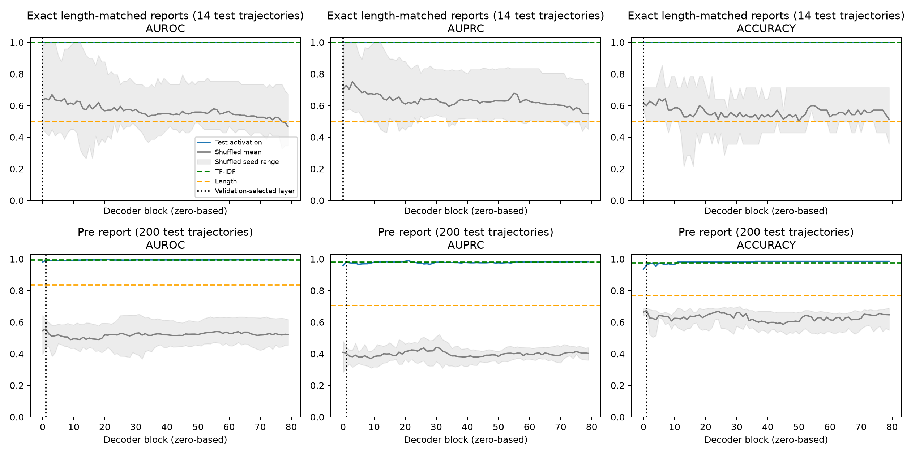
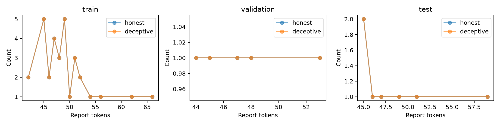

# Insider-trading report controls

## Results

| Method | Matched AUROC | AUPRC | Accuracy | Pre-report AUROC | AUPRC | Accuracy |
| --- | ---: | ---: | ---: | ---: | ---: | ---: |
| Activation | 1.0000 | 1.0000 | 1.0000 | 0.9912 | 0.9800 | 0.9650 |
| TF-IDF | 1.0000 | 1.0000 | 1.0000 | 0.9942 | 0.9788 | 0.9750 |
| Length | 0.5000 | 0.5000 | 0.5000 | 0.8366 | 0.7066 | 0.7700 |
| Shuffled, five-seed mean | 0.6449 | 0.6796 | 0.5571 | 0.5544 | 0.4189 | 0.6150 |
| Constant/majority | 0.5000 | 0.5000 | 0.5000 | 0.5000 | 0.3350 | 0.6650 |

Validation selects matched-report block **0**, C=0.001, and pre-report block **1**,
C=1, both with validation AUROC 1.0. Blocks are zero-based. Matched TF-IDF selects
C=0.001; pre-report TF-IDF selects C=10. All 160 layer fits completed, with five
additional shuffled-label fits per layer and no convergence warnings.





Exact matching removes the length-only signal, but both report TF-IDF and the
activation probe still classify all **14** test reports correctly. This leaves
strong wording cues after length control. The subset is very small: shuffled
AUROC averages 0.6449 with SD 0.2303, and seed 42 also achieves AUROC 1.0 (accuracy
0.6429). Its individual seed AUROCs are 1.0000, 0.6122, 0.4898, 0.7143, 0.4082.
The perfect activation score is not compelling evidence of a special mechanism.

The pre-report activation probe classifies 193/200 correctly; prefix-only TF-IDF
classifies 195/200 correctly and has slightly higher AUROC. Thus the label is
highly predictable before report text appears, but these controls do not show
an activation advantage over the available prefix text. Prefix length itself
is informative (AUROC 0.8366). The pre-report shuffled AUROC mean is 0.5544 with
SD 0.0906; seed 42 alone scores AUROC 0.6264, AUPRC 0.4407, accuracy 0.6750.
The pre-report majority accuracy is 0.665, not 0.5, because labels are imbalanced.

`analyze_report_controls.py` evaluates two controls on the frozen Llama 3.3 70B
insider-trading replay. It reuses the saved residuals and does not load, train, or
modify model weights. The original replay uses FP16 Llama weights at revision
`6f6073b423013f6a7d4d9f39144961bfbfbc386b`, the pinned Llama 3.1 tokenizer at
`1605565b47bb9346c5515c34102e054115b4f98b`, and eager causal attention.
This preserves the original insider-trading representation rather than mixing
in the later BF16/native-3.3-tokenizer roleplaying extraction.

## Cohorts and fixed splits

The script asserts exact equality with the completed
`llama33-probe-eval-v3/evaluation_manifest.jsonl`. Validation was drawn only from
the original training trajectories. No example crosses splits.

| Analysis | Train H/D | Validation H/D | Test H/D |
| --- | ---: | ---: | ---: |
| Exact length-matched report | 31/31 | 5/5 | 7/7 |
| Pre-report, full cohort | 433/217 | 100/50 | 133/67 |

Length matching is maximal exact one-to-one matching within each split and
integer report-token count, without replacement. A fixed RNG seed 42 chooses
among excess candidates, ordered by source ID before shuffling. Only labels,
lengths, fixed splits and IDs enter selection; activations, wording, and probe
scores do not. Honest and deceptive token-count histograms are identical in
each split. All matched pairs and all 914 excluded IDs are recorded. This is a
conditional overlap population, not a representative sample of all rollouts.
Test labels are used for cohort matching, but never for fitting or hyperparameter
selection. Matching does not introduce artificial padding or truncate reports.

## Features and baselines

The matched report probe uses the original FP32 mean of report-token residuals
at every one of the 80 decoder blocks. The report spans `Executed trade update`
through the end of assistant content, excluding EOT. Its TF-IDF baseline sees
the exact report substring; length uses the original report-token count.

The pre-report probe uses the single saved `report_boundary` vector at each
block: the last token immediately before the first token overlapping
`Executed trade update`. It contains no report-body token. Exact prefix text is
decoded from saved input IDs through that boundary with the original tokenizer's
cached JSON. All 1,000 decoded boundaries were checked against stored character
offsets. Its TF-IDF baseline sees only this available prefix (including native
chat markers), and its length baseline uses prefix-token count. Future report
text and report length are not inputs to either pre-report baseline.

This boundary is **after report-stage reasoning and the send_message tool header**.
Prior trading actions and reasoning may already indicate concealment. Good
performance here does not establish prediction before the decision or a latent
intention independent of text.

Saved boundary vectors were extracted from full causal forwards. The original
four-case replay pilot checked truncated-prefix forwards: per-layer relative L2
differences remained below 0.5%, with exact repeat-forward and hook/no-hook checks.
Full/prefix floating-point results are not bitwise identical because sequence
shapes differ. This analysis reuses those vectors; it does not rerun all 1,000
truncated prefixes. Original per-token residuals and pilot evidence are retained.

The classifier procedure is unchanged: training-only StandardScaler; L2/lbfgs
logistic regression, max_iter=2000, random_state=42; C in
[0.001, 0.01, 0.1, 1, 10]. Validation AUROC selects C and then layer, with smaller
C and earlier layer winning ties. TF-IDF uses word unigrams/bigrams, min_df=2,
sublinear TF, training-only vocabulary/IDF and the same C search. Length uses
training-only scaling and C=1. Five shuffled runs (42-46) permute training labels
only and repeat all layer/C selection using true validation labels. They are
controls, not a formal permutation p-value. Positive means deceptive, AUPRC means
average precision, and accuracy uses the unchanged 0.5 threshold.

## Artifacts and reproduction

The completed output directory is `outputs/llama33-report-controls-v2/`.
Each analysis has a manifest, activations in `[trajectory,80,8192]` FP32 format,
labels and raw IDs, all layer/seed scores and predictions, fitted probe weights
and scalers, text and length classifiers, and actual shuffled training labels.
All-layer curves are descriptive; the highlighted layer uses validation only.
Original labels, source IDs and split assignments remain in each manifest.

Large activations stay on `ubuntu@192.222.53.243` under:

```text
/home/ubuntu/epistemic-deference/experiments/apollo_released/outputs/
  llama33-reports-v1/activations/                    # original token residuals
  llama33-report-controls-v2/length_matched/activations.safetensors
  llama33-report-controls-v2/pre_report/activations.safetensors
```

Small outputs, including manifests, predictions, probe weights and plots, are
mirrored locally. `protocol.json` records source and split hashes; `matching.json`
records selection and exclusions. The partial v1 attempt is retained; its
matched-report fit completed, but Transformers could not resolve the cached
3.1 tokenizer configuration. V2 decodes directly with the pinned tokenizer JSON.
No data or modeling setting changed in that fix.

Validation: all 160 saved layer probes reproduce saved predictions with zero
maximum absolute error. Four samples per analysis match the original per-trajectory
activation files exactly. All selected feature values are finite. Thirteen
insider-trading unit tests pass, including exact matching, split preservation,
no replacement, determinism, and missing-overlap rejection. Actual checks and
numerical package versions are saved in `artifact_checks.json`.

Run on the VM from the project root, with a fresh output directory:

```sh
OPENBLAS_NUM_THREADS=2 OMP_NUM_THREADS=2 .venv-probe/bin/python experiments/apollo_released/analyze_report_controls.py experiments/apollo_released/outputs/llama33-reports-v1 --existing-evaluation experiments/apollo_released/outputs/llama33-probe-eval-v3 --output experiments/apollo_released/outputs/llama33-report-controls-v2
```
