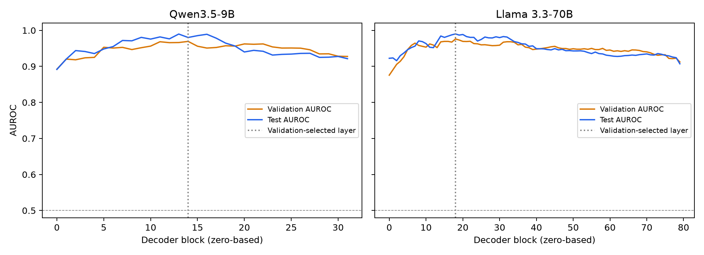

# Matched Qwen and Llama roleplaying experiment

Completed Llama extraction: **742/742 completions, 371 honest and 371 deceptive**, across all 80 decoder blocks. No examples were excluded. The exact Qwen v2 messages, completion strings, labels, IDs, and scenario split assignments were copied and checked: 259 training, 56 validation, and 56 test pairs. No split was regenerated.

## Held-out results

| Method | Qwen AUROC | Qwen AUPRC | Qwen accuracy | Llama AUROC | Llama AUPRC | Llama accuracy |
| --- | ---: | ---: | ---: | ---: | ---: | ---: |
| Activation probe | 0.9802 | 0.9769 | 0.9107 | 0.9901 | 0.9898 | 0.9018 |
| TF-IDF | 0.8839 | 0.8565 | 0.8125 | 0.8839 | 0.8565 | 0.8125 |
| Shuffled activation, five-seed mean | 0.5180 | 0.5429 | 0.4893 | 0.5439 | 0.5568 | 0.5196 |
| Completion length | 0.4944 | 0.4903 | 0.5000 | 0.4917 | 0.4883 | 0.4732 |
| Constant | 0.5000 | 0.5000 | 0.5000 | 0.5000 | 0.5000 | 0.5000 |

Deceptive is positive. AUPRC is average precision. Accuracy uses probability >= 0.5. The test set has 112 answers from 56 paired scenarios. Validation selected Qwen block **14**, C=0.01, and Llama block **18**, C=1 (zero-based indices). Validation AUROCs were 0.9694 and 0.9761 respectively. Test scores did not select a layer, C, or shuffle seed.



The two models perform similarly. Llama minus Qwen AUROC is +0.0099, with a paired scenario bootstrap 95% interval of [-0.0057, 0.0338]. Corresponding AUPRC and accuracy differences are +0.0129 [-0.0064, 0.0413] and -0.0089 [-0.0446, 0.0179]. These intervals use 2,000 resamples of whole test pairs, seed 2026, conditional on the fitted models. They do not establish a model advantage. Accuracy is 101/112 for Llama versus 102/112 for Qwen.

Llama exceeds this TF-IDF baseline in AUROC by 0.1062 [0.0529, 0.1712]. Shuffled-label AUROC is 0.5439 with SD 0.0681 across seeds 42-46; seed 42 alone gives AUROC 0.4825, AUPRC 0.5092, accuracy 0.4732. Length is near chance. Activations therefore add predictive value over this particular text baseline, but this does not isolate deception from contextual meaning or answer style. These are teacher-forced, released Llama-3.1-generated answers with Apollo's construction labels, not spontaneous decisions by either replay model to deceive.

## Matched implementation and differences

Both models are frozen, evaluated without gradients, BF16, with eager attention and no KV cache. Each exact completion is appended to the model's native assistant prefix, without truncation or an added end-of-turn token. Each pair is right-padded to its maximum sequence length, with padding masked and excluded. We save unnormalized output residuals after every decoder block and FP32 means over completion tokens only. These residuals have observed the completion tokens being classified.

The probe uses training-only StandardScaler and L2 logistic regression, lbfgs, max_iter=2000, random_state=42. C is selected from [0.001, 0.01, 0.1, 1, 10] by validation AUROC, with the first C winning ties; the first layer wins layer ties. TF-IDF uses the exact completion strings, word unigrams/bigrams, min_df=2, sublinear TF, training-only vocabulary/IDF, and the same C search. Shuffled controls use identical training-label permutations for seeds 42-46 and retain true validation/test labels. Length uses each model's completion-token count with training-only scaling and C=1.

Llama weights **and native Llama 3.3 tokenizer** are pinned to `meta-llama/Llama-3.3-70B-Instruct` revision `6f6073b423013f6a7d4d9f39144961bfbfbc386b`. This run does not use the earlier insider-trading run's Llama 3.1 tokenizer or FP16 configuration. Qwen remains the completed `qwen9b-paired-v2` run, revision `c202236235762e1c871ad0ccb60c8ee5ba337b9a`.

Unavoidable differences are native tokenization and chat templates, architecture and feature dimension (Llama 80 x 8192 versus Qwen 32 x 4096), and hardware placement (four A6000s versus one A100). Llama's native template date is fixed at `26 Jul 2024`; Qwen uses its native template with `enable_thinking=False`. Exact completion **text** is shared; token IDs and token counts differ. Apollo did not release original provider token IDs. Searching every layer also gives Llama more layer candidates; this is not an equal-capacity comparison.

The numerical runtime matches Qwen: PyTorch 2.14.0+cu130, Transformers 5.17.0, NumPy 2.5.3, scikit-learn 1.9.1. Extraction configuration and runtime details are saved with the run. Layer fits execute in separate CPU processes but use the shared Qwen classifier helper.

## Validation and artifacts

All 742 completion-token roundtrips passed. The pilot reproduced its first forward activations and logits exactly and matched logits with and without hooks. Shared prompt-boundary activations matched exactly for all 371 pairs. All 742 token-activation headers, shapes, IDs, labels, and splits were checked; pooled features were finite. Four sampled completion means exactly matched recomputation from saved token activations. All 80 saved probe weights reproduced their saved predictions exactly. TF-IDF predictions matched Qwen within 2.3e-16. No classifier convergence warning occurred. Nine roleplaying unit tests passed locally.

Local extraction metadata: `outputs/llama33-paired-v1/` (manifest, config, runtime, summary, fidelity and artifact validation). Large activations remain on `ubuntu@192.222.53.243`, under:

```text
/home/ubuntu/epistemic-deference/experiments/apollo_roleplaying/outputs/llama33-paired-v1/
  activations/<example-id>.safetensors  # BF16 [80, completion_tokens, 8192] + boundary
  features.safetensors                # FP32 [742, 80, 8192] means + boundaries
```

Local and remote evaluation: `outputs/llama33-roleplaying-eval-v1/`. It includes all layer metrics, five shuffle searches, scenario bootstrap intervals, layerwise plot, per-layer probe weights/scalers, predictions with test IDs, actual shuffled training labels, and the fitted text classifier. The manifest preserves row order for pooled features. Original Qwen and insider-trading outputs were retained.

## Reproduce

Run from the project root on the GPU VM, using new output directories:

```sh
.venv-probe/bin/python experiments/apollo_roleplaying/run_llama.py --qwen-manifest experiments/apollo_roleplaying/inputs/manifest.jsonl --output experiments/apollo_roleplaying/outputs/llama33-paired-v1
OPENBLAS_NUM_THREADS=2 OMP_NUM_THREADS=2 .venv-probe/bin/python experiments/apollo_roleplaying/evaluate_llama.py experiments/apollo_roleplaying/outputs/llama33-paired-v1 --qwen-manifest experiments/apollo_roleplaying/inputs/manifest.jsonl --qwen-metrics experiments/apollo_roleplaying/outputs/qwen9b-sanity-v1/metrics.json --qwen-probe-metrics experiments/apollo_roleplaying/inputs/probe_metrics.json --qwen-predictions experiments/apollo_roleplaying/inputs/predictions.npz --output experiments/apollo_roleplaying/outputs/llama33-roleplaying-eval-v1
```

The three `inputs/` files are the original Qwen v2 manifest, original per-layer probe metrics, and Qwen sanity-check predictions respectively. The evaluator refuses mismatched examples, splits, test IDs, training-label permutations, or TF-IDF predictions.
